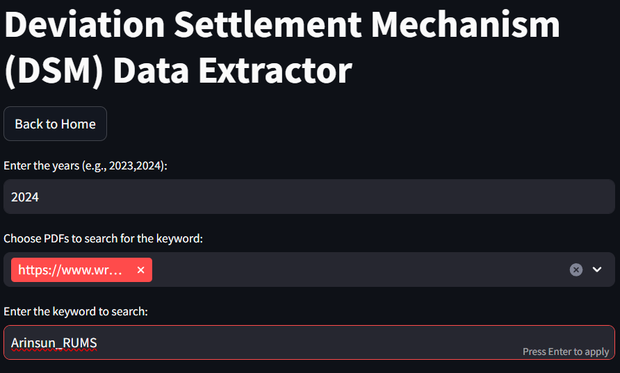
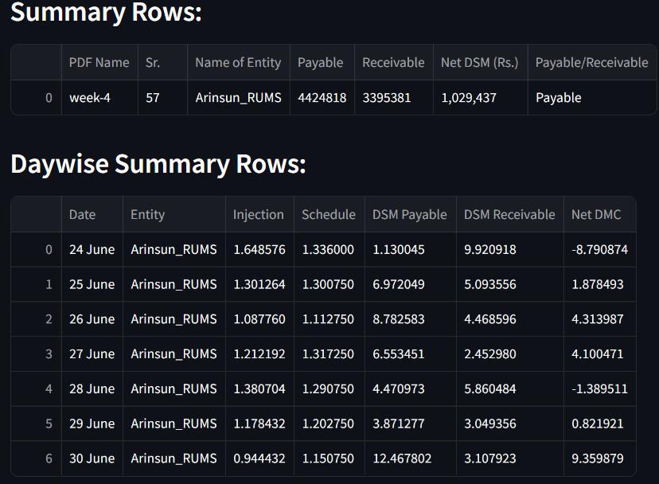

# WRPC Data Extractor

This project was developed during my internship at Havish M Consulting. The Streamlit web application allows users to extract meaningful data from WRPC's PDF reports for monthly Scheduled Revenue and Deviation Settlement Mechanism (DSM). Users can enter a year, select PDFs, and search for specific keywords to generate consolidated Excel reports.

This is the source website for data extraction: [https://wrpc.gov.in/](https://wrpc.gov.in/)

## Features

- **Data Extraction**: Extracts data from WRPC's PDF reports based on user-provided year and search terms.
- **Excel Output**: Generates Excel files containing summarized data for easy analysis.
- **Interactive Interface**: User-friendly interface powered by Streamlit, making it easy to select options and download results.

## Deployment

The application is deployed and accessible online at [WRPC Data Extractor](https://wrpc-hmc.streamlit.app/).

## How to Use

1. **Choose Data Type**: Select between "Monthly Scheduled Revenue" and "Deviation Settlement Mechanism (DSM)".
2. **Enter Year**: Input the desired year(s) for which data extraction is required.
3. **Select PDFs**: Choose specific PDFs from the list provided.
4. **Search Term**: Enter keywords to search within the selected PDFs.
5. **Generate Excel**: Click on the "Download Excel" button to obtain the consolidated data in Excel format.

## Screenshots

*Screenshot of the interface showing data extraction options.*

*Screenshot of the Excel output generated.*

## Dependencies

- Streamlit
- Requests
- pdfplumber
- Pandas

## Installation

To run this application locally:

1. Clone the repository.
2. Install dependencies using `pip install -r requirements.txt`.
3. Run the application with `streamlit run home.py`.
